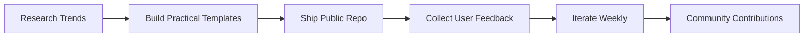

  

  
  
  

 

Practical, production-focused playbooks and templates for building useful AI agents with Anthropic-era patterns (MCP, prompt caching, tool use, GitHub automation).

This repo is designed to help builders ship projects that people actually use.

## Why This Exists

Most AI repos are either:
- too abstract (theory, no implementation),
- too narrow (one demo only), or
- too risky (no safety/cost guidance).

This project gives you a balanced, real-world starter kit:
- actionable templates,
- cost and safety guardrails,
- launch ideas that can go viral because they solve real problems.

## Who It's For

- Students building portfolio projects
- Freelancers shipping AI automations for clients
- Startup teams building internal copilots
- Developers exploring MCP and agent workflows

## What You Get

### 1) Agent Build Patterns
- MCP-first integration strategy
- Prompt caching strategy (5 min vs 1 hour TTL)
- Tool orchestration patterns
- Safety and prompt-injection checklist

### 2) Plug-and-Play Templates
- GitHub Action workflow template for `@claude` automation
- Prompt templates for support, research, and code tasks
- Launch checklist for publishing and growth

### 3) Viral-Ready Project Ideas
- High-utility project ideas with clear target users
- Distribution strategy suggestions
- Positioning hooks for social and LinkedIn

  

## Quick Start

1. Read `guides/research-notes.md`
2. Copy `templates/workflows/claude-code-action.yml` into your repo
3. Adapt prompts from `templates/prompts/agent-prompts.md`
4. Run through `guides/launch-checklist.md`
5. Publish and iterate based on user feedback

## High-Impact Build Ideas

1. **Job Application Co-Pilot**
   - Parse JD, tailor resume bullets, generate outreach messages.
2. **Student Study Agent**
   - Turns notes/PDFs into quiz + revision plan + summaries.
3. **Freelancer Proposal Generator**
   - Creates winning proposals and scopes from client briefs.
4. **Bug Triage Agent for GitHub**
   - Labels issues, suggests fixes, drafts PR plans.
5. **Small Business SOP Agent**
   - Converts messy docs into clean step-by-step SOPs.

  
  
  

## Professional Note on Anthropic

This repo references public capabilities and documentation from Anthropic and the MCP ecosystem to help developers build responsibly.

It is an independent educational project and is not officially affiliated with Anthropic.

## Visual Roadmap

## Contribute

Contributions are welcome:
- Add better templates
- Add safer prompt patterns
- Add real case studies with outcomes

If your addition improves practical usefulness, it belongs here.

  

## Sources

See `guides/sources.md` for referenced public docs and repositories.

